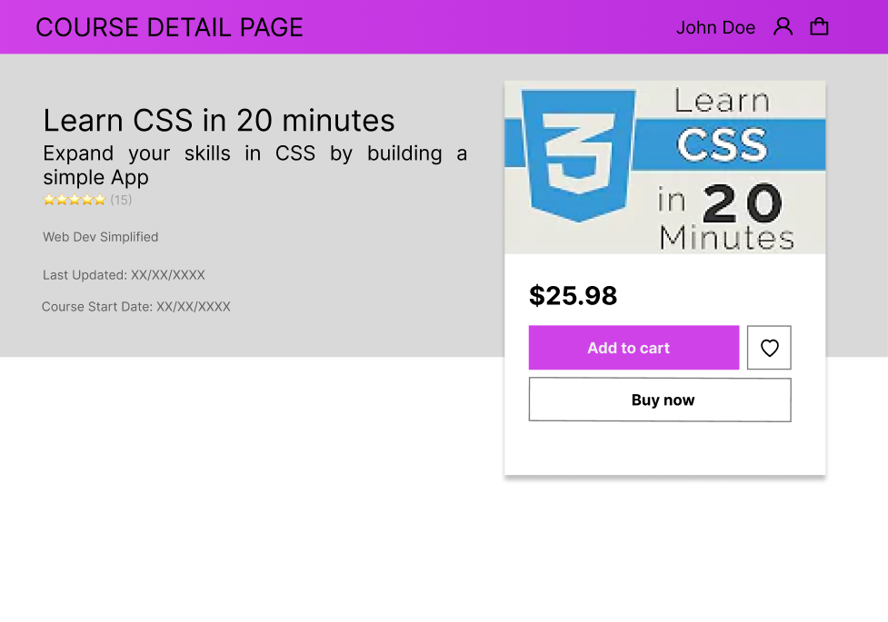
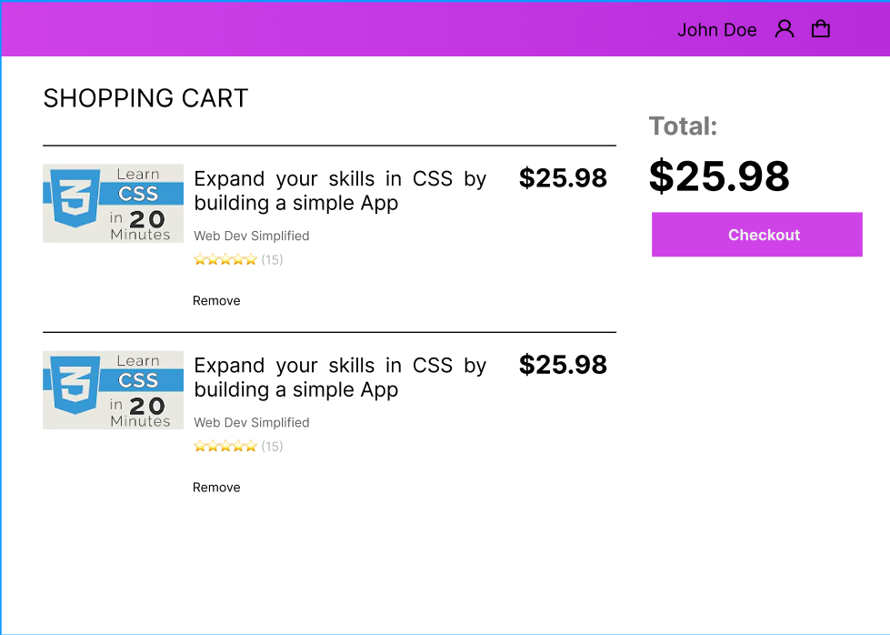

# Super LMS 

 
#### __E-Learning Marketplace (Udemy Clone)__ 
## This is the Repo for the client
## Open the deployed app here: [https://superlms.vercel.app/](https://superlms.vercel.app/)
## Client repo [https://github.com/ernesttan1976/superlmsclient](https://github.com/ernesttan1976/superlmsclient)
## Server repo [https://github.com/ernesttan1976/superlmsserver](https://github.com/ernesttan1976/superlmsserver)

## Wireframes

## User Stories
### For Instructors:

- As an instructor, I want to be able to create and publish new courses for my students. 
  - create course page 
  - edit lesson page 
  - upload image to S3 
  
- As an instructor, I want to be able to upload course materials such as videos, slides, and quizzes. 
  - create lesson page 
  - edit lesson page 
  - upload image and files to S3 
  - video link 
  - show image 
  - show video 
  - show file content 

- As an instructor, I want to be able to track the progress of my students. 
  - lessons completion page 
- As an instructor, I want to be able to communicate with my students through the platform, by sending messages or responding to their questions. 
  - course discussion page 

For Students:

- As a student, I want to be able to browse the available courses and enroll in the ones that interest me.
  - course shop page
  - course preview page
  - shopping cart page
  - stripe payment
- As a student, I want to be able to access course materials from any device. 
  - view course content 
-  As a student, I want to be able to track my progress and see my grades and quiz results. 
  - course progress built into course content page 
-  As a student, I want to be able to communicate with my instructor and classmates through the platform, by sending messages or participating in discussion forums. 
  - course discussion page, create/edit/delete posts 
  
For Admin: 

- As an admin, I want to be able to manage user accounts, including creating new users, deleting users, and changing user roles. 
  - dashboard table and record CRUD 
- As an admin, I want to be able to monitor the activity on the platform, including the courses being created and the student engagement levels. 
  - dashboard chart 
- As an admin, I want to be able to generate reports on the platform usage, such as the number of courses, the number of enrolled students, and the average completion rates. 
  - dashboard chart 
- As an admin, I want to be able to configure and customize the platform settings, such as the branding and the payment options.
  - not required 

## Important Information
Refine framework uses hooks based on an extended version of Tanstack Query. Understanding of how Tanstack query works is important for building the app. "useQuery" is a generic fetching and caching hook which uses a unique caching identifier called the "queryKey".

## Supported Hooks
[https://refine.dev/docs/api-reference/core/providers/data-provider/](https://refine.dev/docs/api-reference/core/providers/data-provider/)

### refine will consume:

1. getList method using the [useList](https://refine.dev/docs/api-reference/core/hooks/data/useList/) or [useInfiniteList](https://refine.dev/docs/api-reference/core/hooks/data/useInfiniteList/) data hook.
2. create method using the [useCreate](https://refine.dev/docs/api-reference/core/hooks/data/useCreate/) data hook.
3. update method using the [useUpdate](https://refine.dev/docs/api-reference/core/hooks/data/useUpdate/) data hook.
4. deleteOne method using the [useDeleteOne](https://refine.dev/docs/api-reference/core/hooks/data/useDelete/) data hook.
5. getOne method using the [useOne](https://refine.dev/docs/api-reference/core/hooks/data/useOne/) data hook.
<!-- 6. getApiUrl method using the useApiUrl data hook.
7. custom method using the useCustom data hook.
8. getMany method using the useMany data hook.
9. createMany method using the useCreateMany data hook.
10. deleteMany method using the useDeleteMany data hook.
11. updateMany method using the useUpdateMany data hook. -->

### useList is an extended version of Tanstack Query's useQuery hook.

### RETURNS of useQuery hook
 >Frequently used: 
 >1. **data**
 >2. **error**
 >3. **status** (loading|success|error)
 >4. **fetchStatus** (idle|fetching|loading|paused)
 >5. **isPreviousData**

### OPTIONS of useQuery hook
 >Frequently used:  
 >1. **queryKey** array of ['items', id], that uniquely identifies the data in the cache ***(note that queryKey is not directly defined in the useList hook)***
 >2. **queryFn** calls the fetch functions ***(note that the data provider that performs the fetch is called by useList based on it is a "List" and the resource = "items" )***
 >3. **enabled** (important) true to run this query, useful to run subqueries when the main query has valid data
 >4. **onSuccess** further actions
 >5. **keepPreviousData** for paginated pages, when moving off the current record, to prevent the loading state being shown [see here](https://tanstack.com/query/v4/docs/react/guides/paginated-queries)
 >6. **Staletime ** 
 >defaultOptions: {queries: {staleTime: X}} Tanstack query will make the data stale after X ms, and auto-refetch.