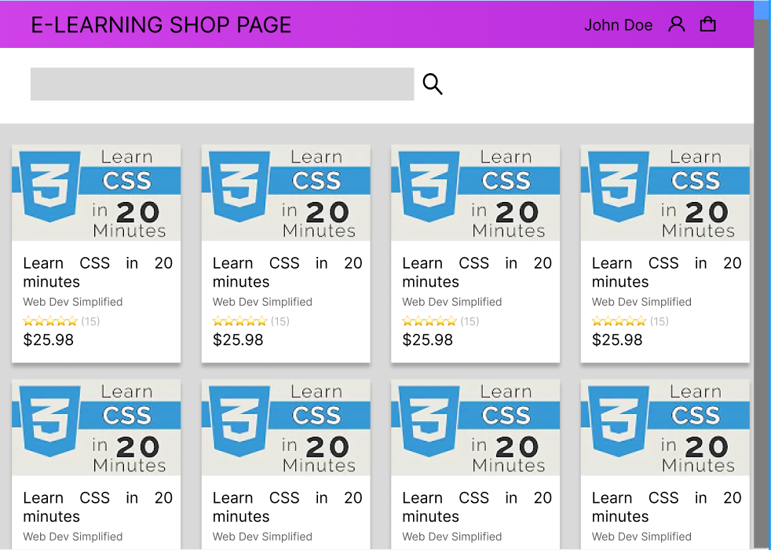

# Super LMS 

 
#### __E-Learning Marketplace (Udemy Clone)__ 
## This is the Repo for the client
## Open the deployed app here: [https://superlms.vercel.app/](https://superlms.vercel.app/)
## Client repo [https://github.com/ernesttan1976/superlmsclient](https://github.com/ernesttan1976/superlmsclient)
## Server repo [https://github.com/ernesttan1976/superlmsserver](https://github.com/ernesttan1976/superlmsserver)

## Wireframes

## User Stories
### For Instructors:

- As an instructor, I want to be able to create and publish new courses for my students. 
  - create course page 
  - edit lesson page 
  - upload image to S3 
  
- As an instructor, I want to be able to upload course materials such as videos, slides, and quizzes. 
  - create lesson page 
  - edit lesson page 
  - upload image and files to S3 
  - video link 
  - show image 
  - show video 
  - show file content 

- As an instructor, I want to be able to track the progress of my students. 
  - lessons completion page 
- As an instructor, I want to be able to communicate with my students through the platform, by sending messages or responding to their questions. 
  - course discussion page 

For Students:

- As a student, I want to be able to browse the available courses and enroll in the ones that interest me.
  - course shop page
  - course preview page
  - shopping cart page
  - stripe payment
- As a student, I want to be able to access course materials from any device. 
  - view course content 
-  As a student, I want to be able to track my progress and see my grades and quiz results. 
  - course progress built into course content page 
-  As a student, I want to be able to communicate with my instructor and classmates through the platform, by sending messages or participating in discussion forums. 
  - course discussion page, create/edit/delete posts 
  
For Admin: 

- As an admin, I want to be able to manage user accounts, including creating new users, deleting users, and changing user roles. 
  - dashboard table and record CRUD 
- As an admin, I want to be able to monitor the activity on the platform, including the courses being created and the student engagement levels. 
  - dashboard chart 
- As an admin, I want to be able to generate reports on the platform usage, such as the number of courses, the number of enrolled students, and the average completion rates. 
  - dashboard chart 
- As an admin, I want to be able to configure and customize the platform settings, such as the branding and the payment options.
  - not required 

